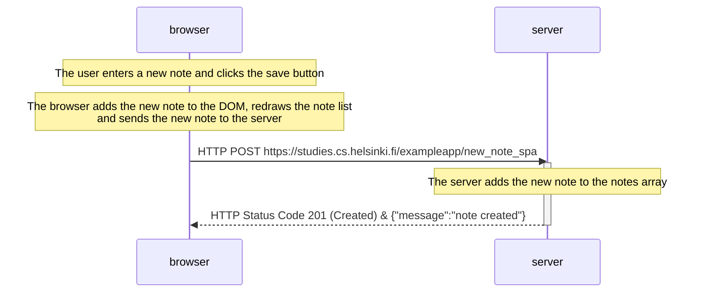

```mermaid
sequenceDiagram
    participant browser
    participant server

    Note over browser: The user enters a new note and clicks the save button
    Note over browser: The browser adds the new note to the DOM, redraws the note list <br/> and sends the new note to the server

    browser->>server: HTTP POST https://studies.cs.helsinki.fi/exampleapp/new_note_spa
    activate server
    Note over server: The server adds the new note to the notes array
    server-->>browser: HTTP Status Code 201 (Created) & {"message":"note created"}
    deactivate server
```